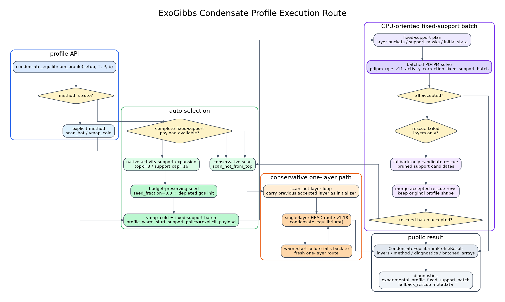

Condensate Profile Execution
============================

Overview
--------
``condensate_equilibrium_profile`` solves a one-dimensional pressure and
temperature profile with the condensate public API.  It is the production
entry point for repeated atmospheric-layer calculations.

The profile API keeps two concerns separate:

* each layer is still validated by the same condensate HEAD route contract as
  ``condensate_equilibrium``;
* profile-level execution chooses how to reuse or batch layer initial states.

The default profile method is ``"auto"``.  This is the recommended mode for
normal use.

Method Selection
----------------
The available profile methods are:

``"auto"``
   Choose the execution path from the supplied inputs.  If the profile carries
   a complete fixed-support payload, ExoGibbs attempts the fixed-support batch
   path with fallback rescue.  Otherwise it uses the conservative hot-scan
   path.

``"scan_hot_from_top"``
   Solve layers from top to bottom, carrying each accepted layer as the next
   layer initializer.  This is the conservative profile path when no fixed
   support payload is available.

``"scan_hot_from_bottom"``
   Same idea as ``"scan_hot_from_top"``, but traverses the profile in the
   opposite direction.

``"vmap_cold"``
   Treat each layer independently except for any explicit initializer.  This
   method is useful when layer-to-layer warm-start dependence is undesirable.

Fixed-Support Batch Path
------------------------
The fixed-support batch path is intended for repeated profile workloads where
the active condensate support is already known or has been prepared from an
earlier pass.  In that case each layer can be evaluated with the same
fixed-support PD-IPM kernel structure and the layers can be dispatched as a
batch.

``"auto"`` enables this path only when the input contains a complete
fixed-support payload.  A complete payload is either:

* top-level ``support_indices`` plus ``support_amounts_init``; or
* one ``CondensateEquilibriumInit`` per layer with gas state and support
  amount information.

If the batch result is accepted, the returned profile result contains
diagnostics under ``"experimental_profile_fixed_support_batch"``.  The route
name for the public auto path is usually
``"experimental_profile_fixed_support_batch_fallback_rescue"``.

Native Activity Support Expansion
---------------------------------
The production fixed-support profile path does not use FastChem4 runtime
values as constructor inputs.  When a complete fixed-support payload is
available, ExoGibbs first treats that payload as a curated starting support,
then expands it with a native gas-only activity screen before building the
batched PD-IPM initial state.

The current default policy is:

* add up to the native activity top ``8`` condensate candidates per layer;
* cap the expanded profile support at ``16`` species;
* seed the selected condensates with budget-preserving amounts using
  ``seed_fraction=0.8`` and ``max_seed_amount=1.0``;
* initialize the gas phase on the depleted element budget
  ``b - A_condensate @ seed``.

These defaults are controlled by ``CondensateEquilibriumOptions``:

.. code-block:: python

   options = CondensateEquilibriumOptions(
       profile_method="auto",
       enable_profile_native_activity_support_expansion=True,
       profile_native_activity_support_topk=8,
       profile_native_activity_max_support_count=16,
       fixed_support_gas_init_policy="depleted_budget",
       seed_fraction=0.8,
       max_seed_amount=1.0,
   )

The older full-budget gas initializer remains available for debugging:

.. code-block:: python

   debug_options = CondensateEquilibriumOptions(
       fixed_support_gas_init_policy="full_budget",
   )

Fallback Rescue
---------------
Fixed support is fast, but it is intentionally not forced.  If one or more
layers fail the fixed-support acceptance checks, the profile path tries a
fallback-only rescue for those layers.  The rescue expands candidate support
only around failed layers and then merges accepted replacements back into the
batched result.

If the rescued batch result still cannot be accepted, the profile API falls
back to the conservative scan path.  This keeps the fast path opportunistic:
it improves throughput when the fixed-support assumption is valid, but it does
not replace the robust one-layer HEAD route.

Minimal Example
---------------
The following example shows the public profile entrance.  It leaves the method
as ``"auto"`` and lets ExoGibbs choose the route.

.. code-block:: python

   from jax import config
   import jax.numpy as jnp

   config.update("jax_enable_x64", True)

   from exogibbs.api.condensate_equilibrium import (
       CondensateEquilibriumOptions,
       condensate_equilibrium_profile,
   )
   from exogibbs.presets.fastchem4_cond import condensate_chemical_setup

   setup = condensate_chemical_setup()
   b = jnp.asarray(setup.gas_setup.element_vector_reference, dtype=jnp.float64)
   T = jnp.asarray([1700.0, 1600.0, 1500.0, 1400.0], dtype=jnp.float64)
   P = jnp.asarray([1.0e-3, 3.0e-3, 1.0e-2, 3.0e-2], dtype=jnp.float64)

   result = condensate_equilibrium_profile(
       setup,
       T=T,
       P=P,
       b=b,
       options=CondensateEquilibriumOptions(profile_method="auto"),
       return_diagnostics=True,
   )

   print(result.method)
   print([layer.status for layer in result.layers])

Diagnostics
-----------
When ``return_diagnostics=True``, profile diagnostics include the selected
profile method and, when applicable, the fixed-support batch report.

Useful fields include:

``result.method``
   The resolved profile method after ``"auto"`` selection.

``result.layers[i].selected_route``
   The route selected for each layer.  For the fixed-support rescue path this
   is usually ``"experimental_profile_fixed_support_batch_fallback_rescue"``.

``result.diagnostics["experimental_profile_fixed_support_batch"]``
   Present when the fixed-support batch path was accepted.  It includes
   fallback/rescue metadata and per-layer acceptance information.

``result.layers[i].diagnostics``
   Per-layer diagnostics.  Fixed-support batch results attach the batch route
   report to each layer so failed or rescued layers can be inspected.

Experimental Payload Helpers
----------------------------
The ``exogibbs.condensates`` namespace includes experimental helpers for
preparing fixed-support payloads before calling the profile API.  These
helpers are intentionally separate from the PD-IPM solver: they only build
explicit support indices, seed amounts, and objective-aware selection reports.

The release-oriented default policy is:

* dynamic top-k grid ``(8, 12, 16)``;
* up to three inactive-driving expansion rounds;
* support cap ``48``;
* objective acceptance requiring convergence, budget residual acceptance,
  non-increasing native ExoGibbs ``G/RT`` against the curated baseline, and
  inactive-driving improvement;
* a support-economy knee rule with inactive-driving factor ``1.5``.

Minimal imports:

.. code-block:: python

   from exogibbs.condensates import (
       FixedSupportPayloadOptions,
       build_dynamic_expansion_payload,
       select_objective_aware_payload,
   )

``build_dynamic_expansion_payload`` expects an already-solved profile result
and returns an explicit support payload that can be passed to
``condensate_equilibrium_profile`` through ``support_indices`` and
``support_amounts_init``.  ``select_objective_aware_payload`` consumes
ExoGibbs-native metrics from candidate payloads and applies the acceptance and
knee rules.  FastChem4 comparison values are not constructor inputs for these
helpers.

GPU Notes
---------
The profile API is backend-neutral.  It uses JAX arrays and therefore runs on
the active JAX backend.  GPU acceleration is most useful when many profile
layers, or many repeated profile evaluations, can share a fixed-support batch
plan.  Single small profiles can be dominated by dispatch and compilation
overhead.

The FastChem4 comparison sweeps used to tune the current default live under
``benchmarks/fastchem4/``.  They compare ExoGibbs outputs with FastChem4
outputs but keep FastChem4 values out of the ExoGibbs constructor path.  In
the curated GPU sweep, the selected global setting was native activity
``topk=8`` with ``seed_fraction=0.8``.  The trace-insensitive major-species
overlap score had worst-family disagreement about ``0.186`` dex, roughly a
factor of ``1.5``.

For production workloads, keep ``method="auto"`` unless a conservative scan is
needed for debugging:

.. code-block:: python

   conservative = CondensateEquilibriumOptions(
       profile_method="scan_hot_from_top",
   )

   independent = CondensateEquilibriumOptions(
       profile_method="vmap_cold",
   )
