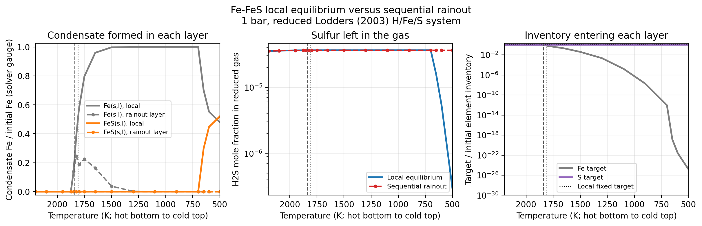

Fe--FeS local equilibrium and rainout
=====================================

Purpose
-------

The Fe--FeS system is a compact demonstration of why sequential rainout is
not equivalent to solving every atmospheric layer independently.  When
condensed iron remains in contact with the gas, cooling permits the secondary
reaction

.. math::

   {\rm Fe(s)} + {\rm H_2S(g)}
   \rightleftharpoons {\rm FeS(s)} + {\rm H_2(g)}.

Local equilibrium therefore transfers sulfur from gaseous H2S to condensed
FeS.  In a rainout sequence, Fe condenses in hotter, deeper layers and is
removed from the elemental inventory passed upward.  The cooler layers then
lack the iron needed to form FeS, and H2S remains in the gas.  Section 2.5 of
`Morley et al. (2012)
<https://doi.org/10.1088/0004-637X/756/2/172>`_ describes this behavior
explicitly; it also appears in the numerical
equilibrium-versus-rainout comparison of `Kitzmann et al. (2024)
<https://doi.org/10.1093/mnras/stad3515>`_.

Reduced calculation
-------------------

Both calculations use the same 17 temperatures from 500 to 2200 K at 1 bar
and the same packaged FastChem4-format thermochemistry.  The deliberately
small chemical system contains

.. code-block:: text

   elements:     H, Fe, S
   gas species:  H, Fe, S, H2, H2S
   condensates:  Fe(s,l), FeS(s,l)

The normalized Lodders (2003) elemental inventory is

.. code-block:: text

   H  = 9.9994713210e-1
   Fe = 3.4671851920e-5
   S  = 1.8196046548e-5

The local-equilibrium calculation solves every temperature independently
from this inventory.  The rainout calculation instead supplies it only at the
hot lower boundary.  ExoGibbs then uses
``CondensateEquilibriumOptions(rainout=True)`` and the
``"scan_hot_from_bottom"`` profile method to propagate the accepted
normalized post-condensation elemental inventory--the gas-only element
budget--toward lower temperatures.  The public profile input and output order
remains top-to-bottom, so the source array is stored cold-to-hot and processed
internally in reverse.

Literature temperature scale
----------------------------

`Visscher, Lodders, and Fegley (2010)
<https://doi.org/10.1088/0004-637X/716/2/1060>`_ approximate the iron
condensation curve by

.. math::

   \frac{10^4}{T_{\rm cond}({\rm Fe})}
   = 5.44 - 0.48\log_{10}(P_T/{\rm bar}) - 0.48[\mathrm{Fe/H}].

At 1 bar and solar metallicity this gives 1838.24 K, slightly above the
1809 K JANAF iron melting boundary adopted in that work.  Iron consequently
first condenses on the liquid branch and then crosses to the solid branch as
the profile cools.  The packaged thermochemical table represents this with
one combined ``Fe(s,l)`` record whose coefficients switch at 1809 K; it does
not report separate solid and liquid amounts.  ``FeS(s,l)`` is likewise a
combined record, although FeS forms on its solid branch in this example.
The FeS coefficient branch switches at 1463 K, well above the 650--700 K
formation bracket obtained below.

The Visscher et al. curve is an external temperature-scale check, not a fit
target for the reduced calculation.  The packaged data and five-species gas
catalog independently give the separate numerical bracket reported below.

Recorded result
---------------

   Solid curves use the original elemental inventory independently at every
   temperature.  Dashed curves with markers show the dependent rainout scan
   from the hot bottom at left to the cold top at right.  The gray dashed and
   dotted vertical lines mark the 1838.24 K Visscher et al. iron fit and the
   1809 K packaged solid/liquid branch boundary, respectively.  Rainout
   condensate amounts are the material formed and removed in each layer, not
   a suspended cloud profile.  Amounts and targets use the H/Fe/S abundance
   gauge that the rainout scheduler renormalizes after each handoff; they are
   not cumulative parcel mass fractions.  The right panel shows the target
   entering each plotted layer.  It clips Fe values at ``1e-30``; the
   calculation and printed summary remain unclipped.

All 17 layers converged in both calculations.  The local profile used
``vmap_cold`` and the dependent profile used ``scan_hot_from_bottom``.  The
recorded transition brackets and cold-layer values are:

.. list-table::
   :header-rows: 1
   :widths: 42 29 29

   * - Quantity
     - Local equilibrium
     - Sequential rainout
   * - Warm edge of ``Fe(s,l)`` on this grid
     - 1850--1875 K
     - not a fixed-inventory boundary
   * - Warm edge of ``FeS(s,l)`` on this grid
     - 650--700 K
     - suppressed
   * - ``FeS(s,l)`` amount at 500 K
     - ``1.805e-5``
     - ``4.863e-30``
   * - H2S mole fraction in the reduced gas at 500 K
     - ``2.960e-7``
     - ``3.639e-5``
   * - Fe target / initial Fe at 500 K
     - 1 by construction
     - ``1.403e-25``

In local equilibrium, the low-temperature FeS amount is comparable to the
entire sulfur inventory and the H2S abundance falls accordingly.  In the
rainout scan, successive Fe condensation leaves only about
``1.4e-25`` of the initial Fe budget available at 500 K.  FeS formation is
therefore negligible while sulfur remains almost entirely available to H2S.
The adjacent-layer handoff and element conservation are both checked by the
regression test for this example.

Morley et al. describe FeS formation broadly below 1000 K, while classical
Jovian examples often place the conversion near 700 K.  This temperature is
not universal: it depends on composition, thermochemical data, and the
pressure-temperature path.  Direct total-pressure dependence largely cancels
for this isolated one-gas-to-one-gas reaction, but pressure can act indirectly
through speciation in broader networks.  The 650--700 K bracket above is the
result of this specific fixed-pressure reduced system, not an imposed
literature fit.

Reproduce the demonstration
----------------------------

Download the :download:`example source
<../examples/comparisons/demo_fe_fes_rainout.py>` or run it from the
repository root:

.. code-block:: bash

   JAX_ENABLE_X64=1 python \
     examples/comparisons/demo_fe_fes_rainout.py

The default PNG is written to ``results/fe_fes_rainout/``.  Regenerate the
tracked documentation image with:

.. code-block:: bash

   JAX_ENABLE_X64=1 python \
     examples/comparisons/demo_fe_fes_rainout.py \
     --figure documents/_static/fe_fes_rainout_demo.png

Add ``--show`` to display the Matplotlib window.

Scope and limitations
---------------------

This is an offline mechanism demonstration, not a complete atmospheric or
cloud model.  It uses a constant pressure, a sparse prescribed temperature
grid, and five gas species chosen to expose the reduced Fe--H2S exchange.  It
does not model settling velocity, vertical mixing, nucleation, particle sizes,
cloud opacity, or radiative feedback.  Omitted gas carriers such as HS,
FeS(g), and sulfur allotropes can shift quantitative boundaries in a broader
chemical network.

Sequential rainout is also path- and grid-dependent: each accepted layer
changes the inventory supplied to the next one.  The example therefore makes
the temperature order explicit and should not be interpreted as a universal
Fe or FeS abundance profile.  Its purpose is the controlled comparison of
fixed-inventory local equilibrium with post-condensation element-inventory
propagation through the same ExoGibbs chemical setup.
