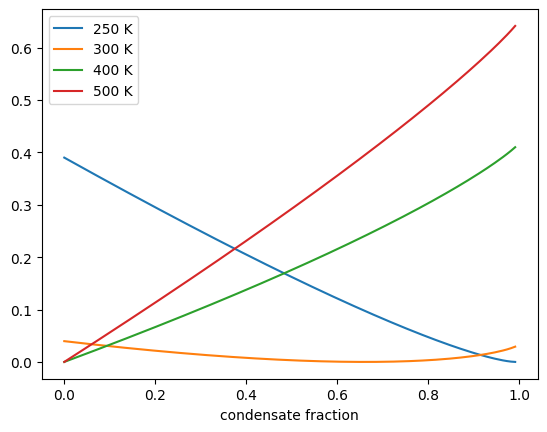
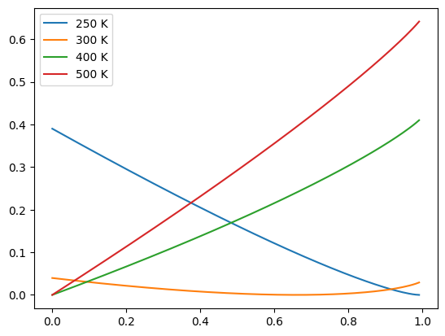
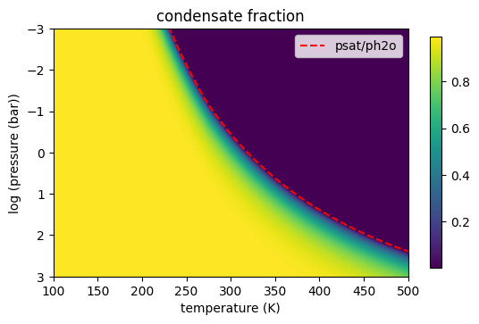

N2 + H2O (gas, condensate)
==========================

Hajime Kawahara 2025/11/16

In this notebook, we adopt N2 as the background atmosphere and water as
a species that can exist either in the gas phase or as a condensate. We
then examine how the phase of water is determined through Gibbs
free‐energy minimization.

.. code:: ipython3

    from jax import config
    config.update("jax_enable_x64", True)

We assume N2+H2O (gas, water, ice) system using fastchem/fastchem_cond
presets.

.. code:: ipython3

    from exogibbs.presets.fastchem_cond import chemsetup as condsetup
    cond = condsetup()
    from exogibbs.presets.fastchem import chemsetup as gassetup
    gas = gassetup()

.. parsed-literal::

    fastchem_cond presets in ExoGibbs
    number of species: 186 elements: 28 molecules: 186
    fastchem presets in ExoGibbs
    number of species: 523 elements: 28 molecules: 495

.. code:: ipython3

    gas_species = list(gas.species)
    gas_system = ['H2O1', 'N2']
    index_h2o_gas = gas_species.index('H2O1')  
    index_n2_gas = gas_species.index('N2')
    
    cond_species = list(cond.species)
    cond_system = ['H2O(s,l)']
    index_h2o_cond = cond_species.index('H2O(s,l)')  

.. code:: ipython3

    from exogibbs.thermo.stoichiometry import build_formula_matrix
    from exogibbs.utils.nameparser import set_elements_from_components
    from exogibbs.utils.nameparser import generate_components_from_formula_list
    
    components_g = generate_components_from_formula_list(gas_system)
    elements = set_elements_from_components(components_g)
    formula_matrix_gas = build_formula_matrix(components_g, elements)
    
    print("Formula matrix (gas):")
    print(formula_matrix_gas)
    
    components_c = generate_components_from_formula_list(cond_system)
    formula_matrix_cond = build_formula_matrix(components_c, elements)
    
    print("Formula matrix (cond):")
    print(formula_matrix_cond)
    

.. parsed-literal::

    Formula matrix (gas):
    [[0 2]
     [2 0]
     [1 0]]
    Formula matrix (cond):
    [[0]
     [2]
     [1]]

Output the reference-state value of ( :math:`h = \mu / (RT)` ) at
temperature ( T ).

.. code:: ipython3

    def h2o_cond_h_values(T): 
        return  cond.hvector_func(T)[index_h2o_cond]
    
    def h2o_gas_h_values(T):
        return  gas.hvector_func(T)[index_h2o_gas]
    
    def n2_gas_h_values(T):
        return  gas.hvector_func(T)[index_n2_gas]

.. code:: ipython3

    import numpy as np
    def gibbs_energy(m, n, nn2, p, T):
        ntot = n + nn2
        mu_h2o = h2o_gas_h_values(T) + np.log(p*n/ntot)
        mu_n2 = n2_gas_h_values(T) + np.log(p*nn2/ntot)
        return h2o_cond_h_values(T)*m + mu_h2o*n + mu_n2*nn2

.. code:: ipython3

    nh2o = 0.1
    
    def gibbs_given(m,T,p=1.0):
        return gibbs_energy(m, nh2o-m, 1.0 - nh2o, p, T)

.. code:: ipython3

    import matplotlib.pyplot as plt

.. code:: ipython3

    marr = np.logspace(-5,np.log10(nh2o),1000)
    for T in [250,300,400,500]:
        plt.plot(marr/nh2o, gibbs_given(marr,T) - np.nanmin(gibbs_given(marr,T)), label=str(T)+" K")
    plt.legend()
    plt.xlabel("condensate fraction")
    #plt.xscale("log")

.. parsed-literal::

    /tmp/ipykernel_16364/2701145478.py:4: RuntimeWarning: divide by zero encountered in log
      mu_h2o = h2o_gas_h_values(T) + np.log(p*n/ntot)

.. parsed-literal::

    Text(0.5, 0, 'condensate fraction')

.. code:: ipython3

    def mmin(T,p=1.0):
        i = np.nanargmin(gibbs_given(marr,T,p))
        return marr[i]

.. code:: ipython3

    from tqdm import tqdm
    Parr = np.logspace(-3,3,150)
    for T in [250,300,400,500]:
        plt.plot(marr/nh2o, gibbs_given(marr,T) - np.nanmin(gibbs_given(marr,T)), label=str(T)+" K")
    plt.legend()
    Tarr = np.linspace(100,500,150)
    
    mastarr = []
    for p in tqdm(Parr):
        mastarr_t = []
        for T in Tarr:
            mastarr_t.append(mmin(T,p))
        mastarr.append(mastarr_t)
    mastarr = np.array(mastarr)

.. parsed-literal::

    /tmp/ipykernel_16364/2701145478.py:4: RuntimeWarning: divide by zero encountered in log
      mu_h2o = h2o_gas_h_values(T) + np.log(p*n/ntot)
    100%|██████████| 150/150 [00:33<00:00,  4.49it/s]

.. code:: ipython3

    from exojax.atm.psat import psat_water_AM01 
    Psat_arr = psat_water_AM01(Tarr)

.. code:: ipython3

    fig = plt.figure()
    ax = fig.add_subplot(111)
    c = ax.imshow(mastarr/nh2o, extent=(Tarr[0],Tarr[-1],np.log10(Parr[-1]),np.log10(Parr[0])))
    plt.plot(Tarr, np.log10(Psat_arr/nh2o), color='red', linestyle='dashed', label='psat/ph2o')
    ax.set_ylim(np.log10(Parr[0]), np.log10(Parr[-1]))
    plt.colorbar(c, shrink=0.7)
    ax.set_aspect(0.7/ax.get_data_ratio())
    plt.gca().invert_yaxis()
    ax.set_xlabel("temperature (K)")
    ax.set_ylabel("log (pressure (bar))")
    ax.set_title("condensate fraction")
    plt.legend()
    plt.show()

In this way, we see that minimizing the Gibbs energy of an ideal gas
together with a condensate does not yield a discontinuous transition.
Instead, the solution provides an approximation in which the transition
occurs continuously over a narrow region near the condensation curve.

