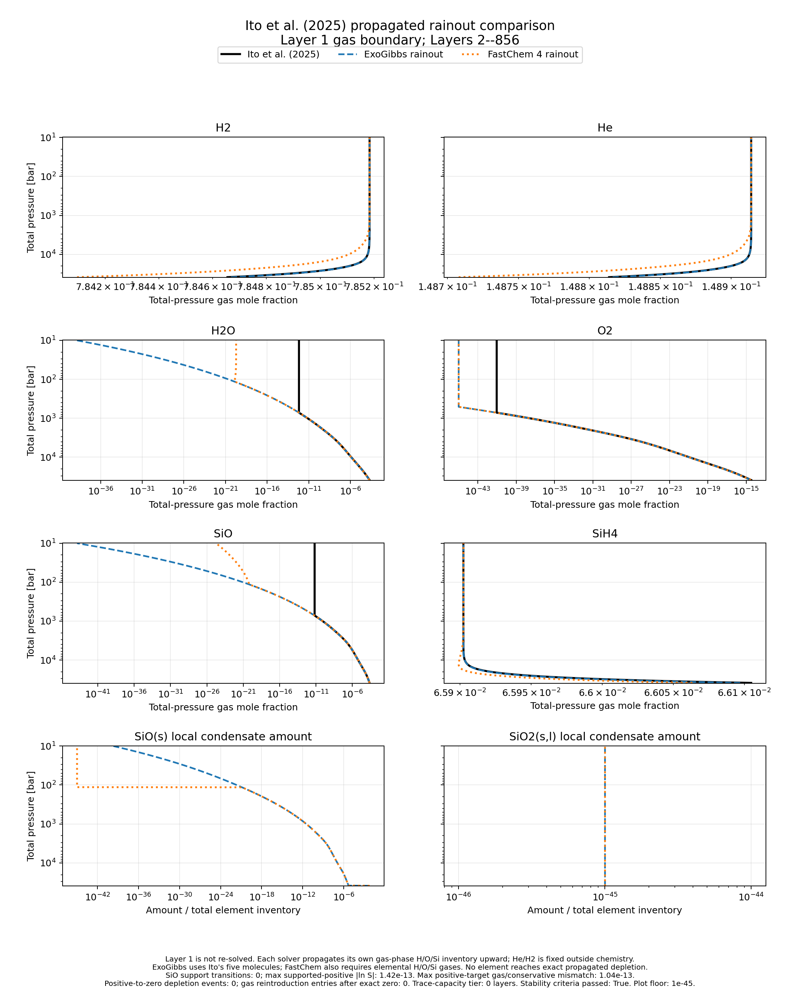

Ito et al. (2025) rainout comparison
=====================================

Purpose
-------

This example compares the H--O--Si rainout profile supplied for
`Ito et al. (2025), ApJ 987, 174
<https://doi.org/10.3847/1538-4357/add3fe>`_ with two independent
calculations:

* ExoGibbs using ``CondensateEquilibriumOptions(rainout=True)`` and the
  bottom-to-top ``"scan_hot_from_bottom"`` profile method; and
* the standalone FastChem 4 executable using its native ``cr`` rainout mode.

The author-supplied workbook is redistributed in this repository with
permission from Yuichi Ito. It covers the ``P > 10 bar`` part of the
calculation associated with Figure 2(a) of the paper. The paper itself is
available from the DOI above and is not duplicated in this repository.

Comparison boundary
-------------------

The workbook contains 856 layers from 38935.466 to 10.048401 bar and from
3000 to 422.06161 K. Its gas columns are ``H2``, ``He``, ``H2O``, ``O2``,
``SiO``, and ``SiH4``. The Layer 1 gas composition reconstructs the supplied
bottom elemental ratios

.. code-block:: text

   H : O : Si : He
   0.885958466 : 0.00585324262 : 0.0376894086 : 0.0704988829

Helium is inert in all three chemistry calculations. After removing it and
normalizing the reactive element inventory, ExoGibbs and FastChem start from

.. code-block:: text

   H : O : Si
   0.953154815563 : 0.00629718729408 : 0.0405479971428

The fixed external ratio is ``He/H2 = 0.189655172414`` by number. Because
helium contributes to total pressure, both comparison calculations iterate a
whole-profile helium-pressure fixed point.

Layer 1 is a boundary, not a shared equilibrium test. Ito's ground layer
includes the magma-contact water-solubility condition and permits only
``SiO2`` condensation. Layers 2--856 instead use gas-phase ``H2``, ``H2O``,
``O2``, ``SiO``, and ``SiH4`` with ``SiO(s)`` and ``SiO2(s,l)`` condensates.
The paper's Section 2.2.2 propagates the gas-phase elemental inventory from
one grid below to represent condensate rainout. The jump between Layer 1 and
Layer 2 discussed in Section 3.1 follows from the different ground and
above-ground equilibrium systems.

For the comparison below, each solver receives the Layer 1 gas-derived H/O/Si
inventory once and then propagates its *own* accepted gas inventory upward.
Ito's upper-layer composition is never used to initialize or repair either
solver. ExoGibbs retains the exact five-molecule network. FastChem also needs
the elemental reference gases ``H``, ``O``, and ``Si`` in its catalog.

Recorded result
---------------

   Propagated rainout comparison for Layers 2--856. Black curves are the
   author-supplied Ito profile, blue dashed curves are ExoGibbs, and orange
   dotted curves are FastChem 4. Ito did not provide local condensate amounts,
   so the two lower panels compare only ExoGibbs and FastChem. The plotting
   floor is ``1e-45``; un-clipped values remain in generated CSV and NPZ
   outputs.

All 855 ExoGibbs layers and all 855 FastChem layers converged. ExoGibbs used
the ordinary ``fixed_support_v2_accepted`` tier at every layer; the disabled
trace-capacity escape tier was never used. The helium-pressure fixed point
converged in two ExoGibbs profile evaluations and three FastChem profile
evaluations.

Numerical stability checks
--------------------------

The low-pressure trace inventory is more demanding than the visual agreement
of the major gases. In the canonical amount-gauge audit, oxygen falls below
the configured caller-gauge budget floor from Layer 187 onward and reaches
approximately ``9.97e-40`` at Layer 856. The recorded profile nevertheless
passed every declared rerun criterion:

.. list-table::
   :header-rows: 1
   :widths: 55 22 23

   * - Check
     - Recorded value
     - Acceptance threshold
   * - Converged ExoGibbs layers
     - 855 / 855
     - 855 / 855
   * - Maximum ``|ln S|`` for supported positive ``SiO(s)``
     - ``1.42e-13``
     - ``1e-5``
   * - Maximum positive-target relative inventory mismatch
     - ``1.04e-13``
     - ``1e-3``
   * - Positive-to-exact-zero depletion events
     - 0
     - 0
   * - Gas reintroduction entries after exact depletion
     - 0
     - 0
   * - Trace-capacity acceptance layers
     - 0
     - 0

Here ``S = exp(A_cond.T @ lambda - h_cond)`` is the reconstructed SiO
saturation ratio. The authoritative rainout inventory is
``b_current - A_cond @ m_cond``; ``A_gas @ n_gas`` is an independent
conservation cross-check.

Agreement before Ito's trailing plateaus
----------------------------------------

Several Ito columns become exactly constant in the upper part of the supplied
table. Those trailing values are reporting plateaus rather than a resolved
trace-species profile. Full-profile logarithmic differences therefore become
arbitrarily large once one calculation continues below another output floor.
The table below reports the maximum absolute difference before the trailing
plateau of each Ito species.

.. list-table::
   :header-rows: 1
   :widths: 16 28 28 28

   * - Species
     - ExoGibbs--Ito [dex]
     - FastChem--Ito [dex]
     - ExoGibbs--FastChem [dex]
   * - ``H2``
     - ``7.20e-6``
     - ``3.10e-4``
     - ``3.17e-4``
   * - ``He``
     - ``7.20e-6``
     - ``3.10e-4``
     - ``3.17e-4``
   * - ``H2O``
     - ``2.93e-2``
     - ``3.00e-2``
     - ``7.29e-4``
   * - ``O2``
     - ``3.98e-2``
     - ``4.01e-2``
     - ``8.25e-4``
   * - ``SiO``
     - ``1.45e-2``
     - ``1.45e-2``
     - ``1.01e-7``
   * - ``SiH4``
     - ``5.09e-5``
     - ``2.72e-4``
     - ``2.21e-4``

The close ExoGibbs--FastChem agreement before the plateaus is the most direct
cross-code comparison. Differences from Ito also include thermochemical-data,
catalog, algorithm, and printed-output-precision differences. This example
does not treat one implementation as constructor input for another.

Reproduce the comparison
------------------------

The recursive rainout example and the related Ito-anchored layer comparison
are available as source downloads:

* :download:`recursive Layer 1 rainout comparison
  <../examples/comparisons/comparison_with_ito_2025_rainout.py>`
* :download:`one-grid Ito-anchored comparison
  <../examples/comparisons/comparison_with_ito_2025.py>`
* :download:`author-supplied Ito workbook <../external_data/Ito_2025.xlsx>`

Build a standalone FastChem 4 executable as described in
:doc:`fastchem4_production_comparison`, then run from the repository root:

.. code-block:: bash

   JAX_ENABLE_X64=1 python \
     examples/comparisons/comparison_with_ito_2025_rainout.py \
     --fastchem-executable /path/to/fastchem \
     --input external_data/Ito_2025.xlsx

The default CSV, JSON, NPZ, and PNG outputs are written under
``results/ito_2025_rainout/``. Results are intentionally ignored by Git. To
regenerate the tracked documentation figure, add

.. code-block:: bash

   --figure documents/_static/ito_2025_rainout_comparison.png

The recorded figure used FastChem 4.0.3 at commit
``ae67cbd559bc64a3233a1cee6030b8e6b50520de``. Its executable SHA256 was
``70de00e79d53141730d9e3b62001e23f644317062cdc3e7338c6e64379d4e741``.

Data provenance and limitations
-------------------------------

The workbook was provided by Yuichi Ito for this validation and is
redistributed with permission. It is an author-supplied export for the
published calculation, not an official journal supplementary file. Its
SHA256 is
``5029bd874e813d3cd43407d551a2b693c4d0e52a8b0ab2f7f94a907b21e44bb1``.
Scientific use of the workbook or this comparison should cite the paper.

The workbook reports temperature, pressure, and gas fractions but not local
condensate amounts or the layer-by-layer elemental inventories used
internally by Ito's calculation. ExoGibbs reconstructs the Layer 1 H/O/Si
inventory from the gas fractions and records every subsequently propagated
inventory. The comparison therefore tests whether independently propagated
profiles remain consistent; it cannot directly compare Ito's local
condensate allocation.
