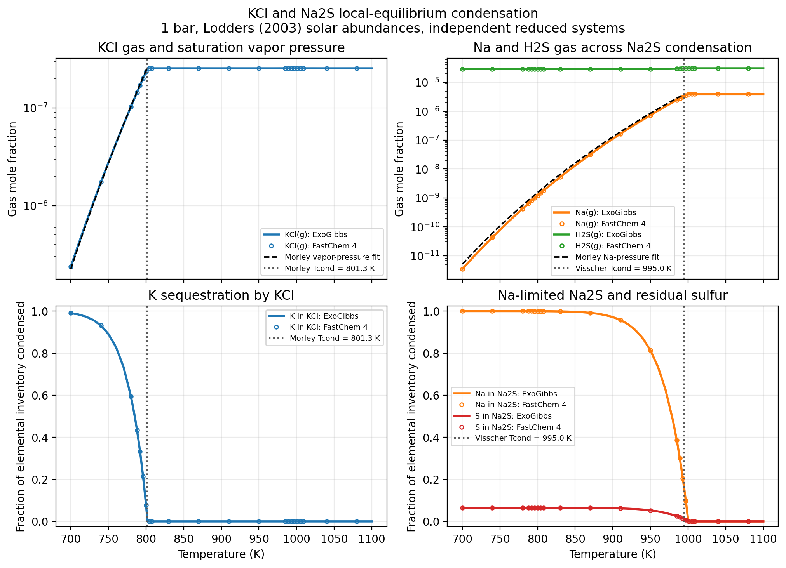

Visscher et al. (2006) Na2S and Morley et al. (2012) KCl
========================================================

Purpose
-------

This example is a compact equilibrium-condensation check for two cool-cloud
species.  It scans temperature at a fixed total pressure of 1 bar using two
independent reduced systems and the protosolar elemental abundances of
`Lodders (2003) <https://doi.org/10.1086/375492>`_.  The KCl calculation uses
``H/He/K/Cl`` and the Na2S calculation uses ``H/He/Na/S``.  Helium is retained
in the pressure and abundance normalization but is chemically inert.  Each
system permits only its target combined solid/liquid record, ``KCl(s,l)`` or
``Na2S(s,l)``; the solid branch is stable around both transitions.

The reduced system isolates two complementary cases:

* ``KCl(g) -> KCl(s)`` is direct vapor--solid equilibrium; and
* ``2 Na + H2S -> Na2S(s) + H2`` is reactive condensation with sodium as the
  limiting element in a protosolar mixture.

Literature checks
-----------------

Na2S
^^^^

`Visscher, Lodders, and Fegley (2006)
<https://doi.org/10.1086/506245>`_ derive their equation (28) for sodium
sulfide condensation (the manuscript was posted as
`astro-ph/0511136 <https://arxiv.org/abs/astro-ph/0511136>`_ in 2005):

.. math::

   \frac{10^4}{T_{\rm cond}({\rm Na_2S})}
   \simeq 10.05 - 0.72\left(
   \log_{10} P_T + [{\rm Na/H}] + \frac{1}{2}[{\rm S/H}]
   \right).

For uniform heavy-element scaling this becomes

.. math::

   \frac{10^4}{T_{\rm cond}({\rm Na_2S})}
   \simeq 10.05 - 0.72\log_{10} P_T - 1.08[{\rm M/H}].

The cold-side atomic-sodium reference plotted below is equation (12) of
`Morley et al. (2012) <https://doi.org/10.1088/0004-637X/756/2/172>`_:

.. math::

   \log_{10} p'_{\rm Na}
   \simeq 8.550 - \frac{13889}{T} - 0.5[{\rm Fe/H}].

At 1 bar and solar metallicity, the fit gives approximately 995 K.  The
protosolar ``Na/S`` ratio is about 0.13, so complete sodium sequestration in
``Na2S`` consumes only about 6.5 percent of the sulfur inventory.  This gives
the example a separate stoichiometric limiting-element check.

KCl
^^^

KCl is not treated in the Visscher et al. sulfur paper.  Its vapor-pressure
and condensation fits used here instead come from equations (17)--(20) of
`Morley et al. (2012) <https://doi.org/10.1088/0004-637X/756/2/172>`_:

.. math::

   \log_{10} p'_{\rm KCl} \simeq 7.611 - \frac{11382}{T},

.. math::

   \log_{10} p^*_{\rm KCl}
   \simeq -6.593 + \log_{10} p_t + [{\rm Fe/H}],

.. math::

   \frac{10^4}{T_{\rm cond}({\rm KCl})}
   \simeq 12.479 - 0.879\log_{10} p_t - 0.879[{\rm Fe/H}].

Temperatures are in kelvin and pressures are in bar.  At 1 bar and solar
metallicity, the condensation fit gives approximately 801 K.  ``[Fe/H]`` is the
paper's proxy for a uniform metallicity scaling; iron is not part of this
reduced chemical system.  Below the transition, the first fit also supplies
the ideal-gas reference ``X_KCl = p'_KCl / p_t``.

The analytic curves are independent scientific checks, not exact expected
answers for the shared numerical thermochemistry.  They were fitted for the
species networks, abundance assumptions, and thermochemical data used in the
source papers.

Recorded comparison
-------------------

   One-bar local-equilibrium temperature scans for the independent reduced
   ``H/He/K/Cl`` and ``H/He/Na/S`` systems.  The literature fits provide
   condensation and vapor-pressure references; open circles show the
   standalone FastChem 4 shared-data comparison.

The ExoGibbs and FastChem calculations use corresponding reduced catalogs
from the FastChem 4-format gas and condensate data.  In particular, the
``KCl(s,l)`` and ``Na2S(s,l)`` records both cite the Chase et al. (1998) JANAF
tables.  Agreement between the solvers therefore tests numerical parity on
shared thermochemistry; it is not an independent validation of those JANAF
records.  FastChem output is compared only after the ExoGibbs calculation and
is never used to initialize, select support for, or retry ExoGibbs.

All 87 temperature points converged in each ExoGibbs calculation and in each
FastChem 4 calculation.  The one-kelvin transition brackets and literature
fits are:

.. list-table::
   :header-rows: 1
   :widths: 22 29 24

   * - Condensate
     - ExoGibbs transition bracket
     - Literature fit
   * - ``KCl(s,l)``
     - 802--803 K
     - 801.35 K
   * - ``Na2S(s,l)``
     - 1000--1001 K
     - 995.02 K

Across the plotted grid, the maximum ExoGibbs--FastChem difference among the
key gases is ``1.75e-4`` dex for the KCl system and ``1.06e-5`` dex for the
Na2S system.  The maximum absolute condensate-amount differences are
``1.20e-14`` and ``3.16e-14``, respectively.  The targeted offline regression
test uses a sparse grid to require both transitions, the cold-side KCl vapor
pressure, and sodium-limited sulfur removal through the production solver.

The recorded FastChem curves used FastChem 4.0.3 at commit
``ae67cbd559bc64a3233a1cee6030b8e6b50520de``.  The standalone executable
SHA256 was
``70de00e79d53141730d9e3b62001e23f644317062cdc3e7338c6e64379d4e741``.

Reproduce the comparison
------------------------

Download the :download:`comparison source
<../examples/comparisons/comparison_with_visscher_2006_na2s_morley_2012_kcl.py>`
or run it from the repository root.  The ExoGibbs and analytic-fit
demonstration is offline:

.. code-block:: bash

   JAX_ENABLE_X64=1 python \
     examples/comparisons/comparison_with_visscher_2006_na2s_morley_2012_kcl.py

Build a standalone FastChem 4 executable as described in
:doc:`fastchem4_production_comparison`, then add it for the cross-solver
comparison:

.. code-block:: bash

   JAX_ENABLE_X64=1 python \
     examples/comparisons/comparison_with_visscher_2006_na2s_morley_2012_kcl.py \
     --fastchem-executable /path/to/fastchem

The default PNG is written under
``results/visscher_2006_na2s_morley_2012_kcl/``.  Regenerate the tracked
documentation figure with:

.. code-block:: bash

   JAX_ENABLE_X64=1 python \
     examples/comparisons/comparison_with_visscher_2006_na2s_morley_2012_kcl.py \
     --fastchem-executable /path/to/fastchem \
     --figure documents/_static/visscher_2006_na2s_morley_2012_kcl.png

Add ``--show`` to display the Matplotlib window.

Scope and limitations
---------------------

Every temperature is an independent local-equilibrium calculation with the
same elemental inventory.  The example does not propagate depleted gas
between layers and therefore does not model rainout, settling, vertical
transport, nucleation, particle sizes, or cloud opacity.

This is also deliberately not a full-catalog solar-composition calculation.
Restricting the elements, gas reactions, and condensates removes competing
phases that would otherwise change the Na, S, K, and Cl budgets.  Solving the
two reactions independently also prevents one benchmark from changing the
other's elemental inventory.  Consequently the example isolates the two
literature checks and is suitable for a small regression, but its abundance
curves must not be interpreted as a complete brown-dwarf or giant-planet
cloud sequence.
