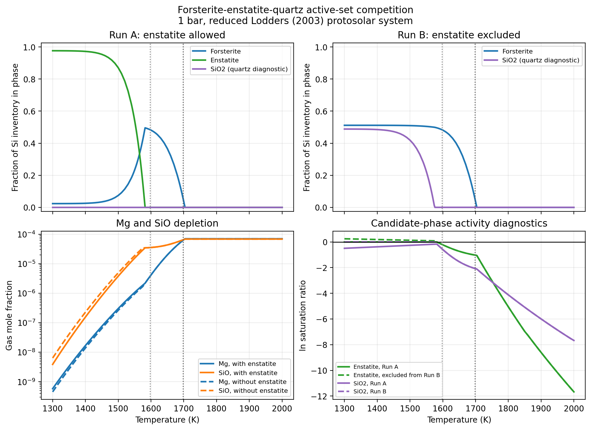

Visscher et al. (2010) forsterite--enstatite competition
=========================================================

Purpose
-------

This example isolates the active-set competition among forsterite,
enstatite, and a diagnostic silica condensate.  Two one-bar temperature scans
use the same gas species, Lodders (2003) protosolar elemental inventory, and
packaged thermochemistry:

* Run A permits ``Mg2SiO4(s,l)``, ``MgSiO3(s,l)``, and ``SiO2(s,l)``; and
* Run B removes only ``MgSiO3(s,l)`` from the candidate set.

Every temperature from 1300 to 2000 K is an independent local-equilibrium
calculation with the same bulk inventory.  Run B is therefore a controlled
candidate-phase ablation, not a rainout sequence.

The reduced gas catalog is ``H2``, ``He``, ``CO``, ``H2O``, ``Mg``, and
``SiO`` over the elements ``H/He/C/O/Mg/Si``.  The core reactions involve
only H/O/Mg/Si.  Helium retains its inert contribution to total pressure, and
C/CO supplies the leading protosolar oxygen sink.  This six-carrier network
keeps the demonstration small while preserving the water abundance relevant
to the literature condensation curves.

Literature checks
-----------------

`Visscher, Lodders, and Fegley (2010)
<https://doi.org/10.1088/0004-637X/716/2/1060>`_ describe forsterite and
enstatite formation through

.. math::

   2{\rm Mg} + 3{\rm H_2O} + {\rm SiO}
   \rightarrow {\rm Mg_2SiO_4(s)} + 3{\rm H_2},

.. math::

   {\rm Mg} + 2{\rm H_2O} + {\rm SiO}
   \rightarrow {\rm MgSiO_3(s)} + 2{\rm H_2}.

Their approximate condensation curves are

.. math::

   \frac{10^4}{T_{\rm cond}({\rm Mg_2SiO_4})}
   \simeq 5.89 - 0.37\log_{10}P_T - 0.73[{\rm Fe/H}],

.. math::

   \frac{10^4}{T_{\rm cond}({\rm MgSiO_3})}
   \simeq 6.26 - 0.35\log_{10}P_T - 0.70[{\rm Fe/H}].

Here temperature is in kelvin, pressure is in bar, and ``[Fe/H]`` is the
paper's proxy for uniform metallicity scaling; Fe is not included in the
reduced system.

At 1 bar and solar metallicity these fits give 1697.79 K for forsterite and
1597.44 K for enstatite.  Figure 10 of the paper also compares calculations
with and without enstatite: silica condenses only when enstatite formation is
suppressed.  The open-access manuscript is available as
`arXiv:1001.3639 <https://arxiv.org/abs/1001.3639>`_.

Recorded comparison
-------------------

   Run A allows all three phases; Run B excludes only enstatite.  The upper
   panels show the fraction of the total silicon inventory assigned to each
   condensate.  The lower panels show Mg and SiO gas depletion and saturation
   diagnostics reconstructed from the equilibrium gas state.  Vertical lines
   mark the two Visscher et al. condensation fits.

All 127 temperature points converged in both calculations.  The transition
brackets on the recorded two-kelvin refined grids are:

.. list-table::
   :header-rows: 1
   :widths: 28 27 24

   * - Candidate set and phase
     - ExoGibbs transition bracket
     - Literature fit
   * - Run A/B: forsterite
     - 1702--1704 K
     - 1697.79 K
   * - Run A: enstatite
     - 1580--1582 K
     - 1597.44 K
   * - Run A: silica
     - absent over the grid
     - suppressed
   * - Run B: silica
     - 1574--1576 K
     - no analytic fit used

The phase split makes the competition explicit.  At 1300 K, Run A places
approximately 97.67 percent of the silicon in enstatite and 2.33 percent in
forsterite, with no silica.  Run B instead places approximately 51.16 percent
in forsterite and 48.84 percent in silica.  The latter values follow directly
from the slightly super-unity protosolar Mg/Si ratio: without enstatite,
forsterite consumes essentially all Mg and about half of the Si, leaving the
rest for silica.

The lower-right panel evaluates the enstatite and silica formulas against
both gas solutions using

.. math::

   \ln S = A_{\rm cond}^{T}\lambda - h_{\rm cond}.

At 1550 K, both supported magnesium silicates in Run A have ``S = 1`` while
silica has ``S = 0.815`` and remains suppressed.  In Run B, forsterite and
silica have ``S = 1``; the excluded enstatite formula has diagnostic
``S = 1.108``.  Its supersaturation is expected because Run B deliberately
removes that phase from the feasible active set.

The packaged forsterite and enstatite combined solid/liquid records cite the
Chase et al. (1998) JANAF tables.  The ``SiO2(s,l)`` record instead cites
Barin (1993) and does not identify a particular solid polymorph.  It is called
a quartz diagnostic here to follow Visscher et al.; numerically it is the
packaged combined silica record.

Reproduce the comparison
------------------------

Download the :download:`comparison source
<../examples/comparisons/comparison_with_visscher_2010_forsterite_enstatite.py>`
or run it from the repository root:

.. code-block:: bash

   JAX_ENABLE_X64=1 python \
     examples/comparisons/comparison_with_visscher_2010_forsterite_enstatite.py

The default PNG is written under
``results/visscher_2010_forsterite_enstatite/``.  Regenerate the tracked
documentation figure with:

.. code-block:: bash

   JAX_ENABLE_X64=1 python \
     examples/comparisons/comparison_with_visscher_2010_forsterite_enstatite.py \
     --figure \
     documents/_static/visscher_2010_forsterite_enstatite_competition.png

Add ``--show`` to display the Matplotlib window.

Scope and limitations
---------------------

This is a minimal reaction network, not a full protosolar gas catalog.  In
particular, carbon is represented only by CO, and Mg and Si gas are represented
only by Mg and SiO.  The model is designed for this 1300--2000 K, one-bar
competition demonstration and should not be generalized to low temperatures,
other C/O ratios, or complete atmospheric chemistry.

The literature curves are external benchmarks for the transition order and
temperature scale, not exact expected answers.  Differences also reflect the
reduced species catalog and thermochemical database.  Internally, phase
activity and conservation are evaluated with the same packaged data used by
the solver.

Finally, these are local chemical equilibria.  The example does not model
rainout, settling, vertical transport, nucleation, particle size, solid
solutions, or cloud opacity.  Excluding enstatite in Run B is a diagnostic
intervention rather than a physical kinetic model.
